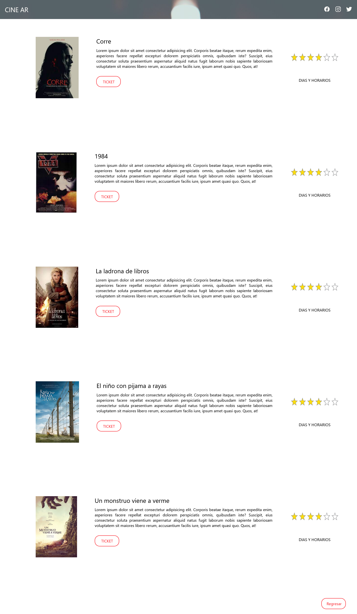

# Comenzando con react js

Primer proyecto con react js, para un trabajo de la facultad. Es basicamente la copia del [2-PagSimpleCine](https://github.com/AraMilagros/Proyectos-varios-HTML-CSS-JS/tree/main/2-PagSimpleCine). Pero ahora los datos de las películas son pasadas por medio de un json.

-Si el proyecto se descarga/clona, para poder ejecutarlo primero se debera poner en consola:

# 'npm install'

y luego que se hayan descargado las dependencias necesarias: 

# 'npm start'

#Capturas

-portada

-listado de peliculas

